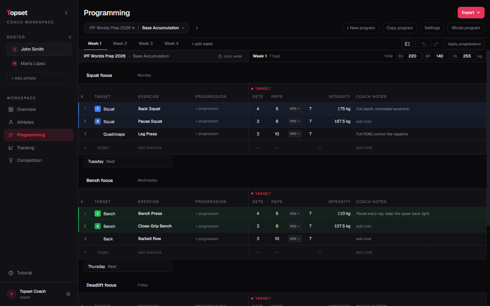
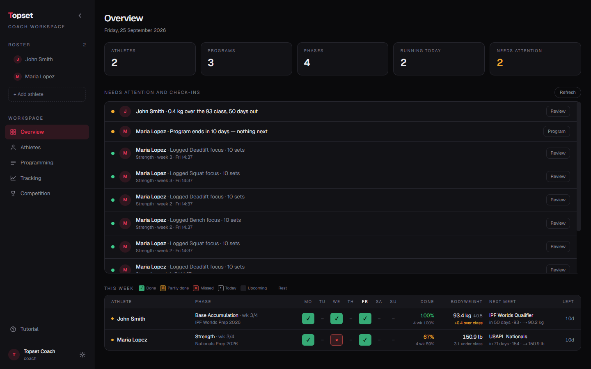
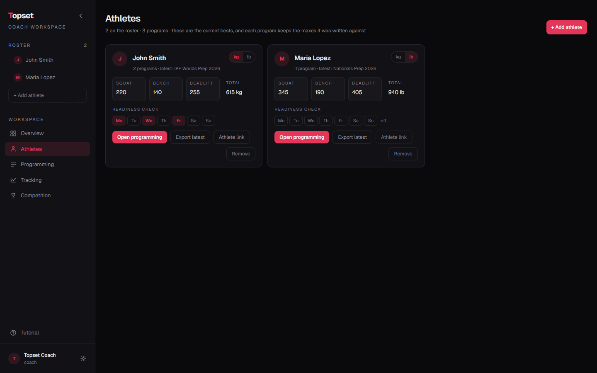
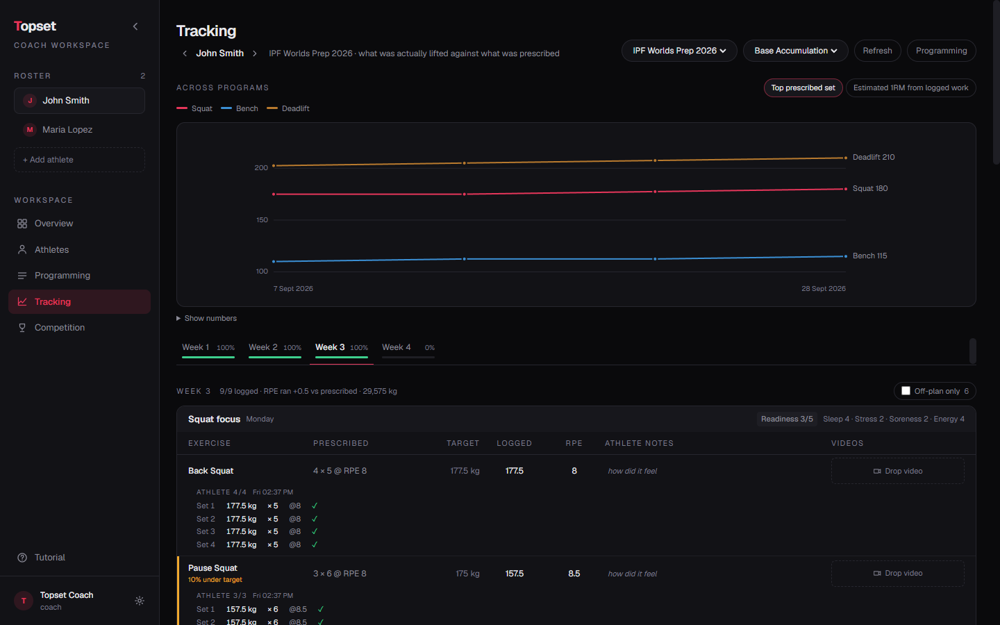
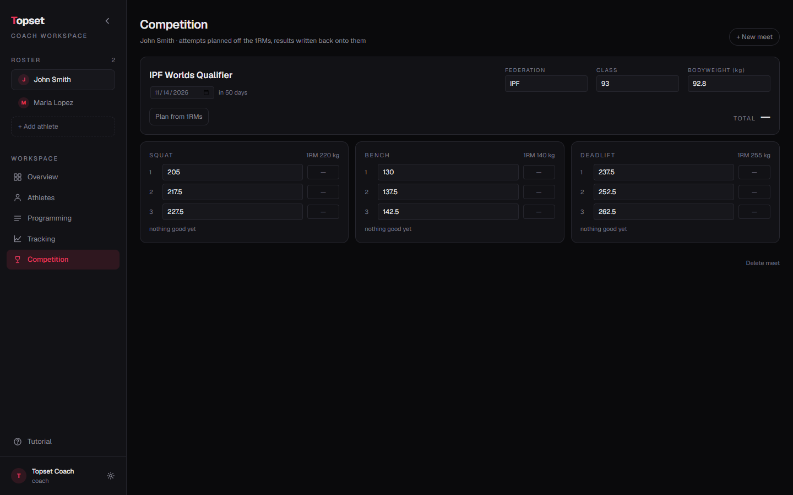
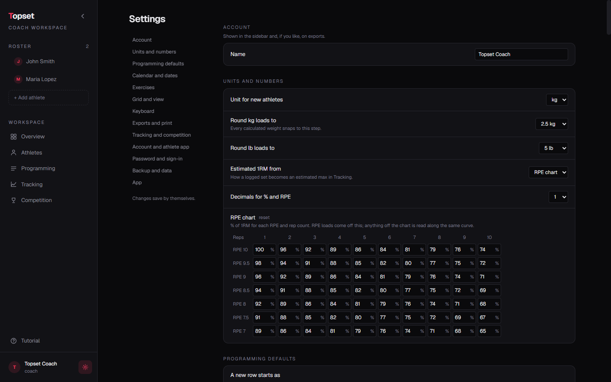
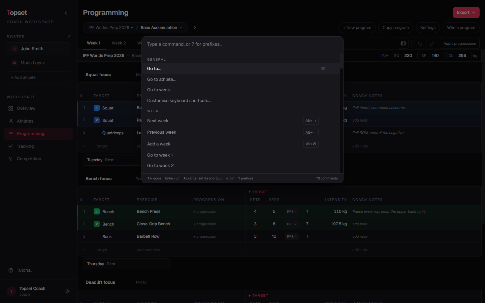
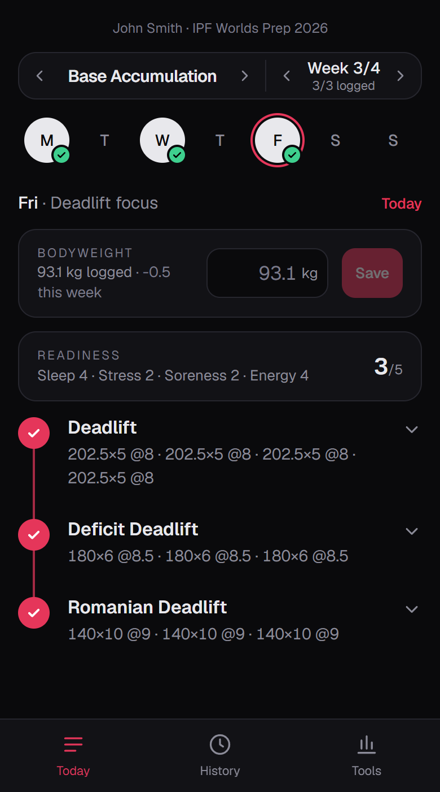

# Topset

A programming workspace for powerlifting coaches. Write training blocks in a grid that works like a spreadsheet, get real target weights calculated from each athlete's 1RMs, and hand the plan out as a phone app, a PDF, a printout or an Excel file.

Topset runs as a desktop app (**Topset.exe**, Windows). Everything you write stays on your own computer, so it is instant and works offline. If your admin runs a Topset server, you can sign in and give each athlete a personal check-in link.

Available in English, Deutsch, Français and Lëtzebuergesch (**Settings → App → Language**).



---

## Getting started

1. Download **Topset.zip** from [Releases](https://github.com/Florian-Stronck/topset/releases), unzip it to a folder of its own (for example `Documents\Topset`) and open **Topset.exe** inside it. Your data (`topset.db`) and backups (`topset-backups`) are kept in that folder. Windows may warn that the app is from an unknown publisher, since the build isn't code-signed: click **More info → Run anyway**.
2. The first start offers a two-minute tutorial with an example athlete. You can run it again any time from **Tutorial** in the sidebar.
3. Add your athletes on **Athletes**, with their squat, bench and deadlift 1RMs.
4. Open **Programming**, click **+ New program**, and start writing.

**Want to give athletes the phone app?** Ask your admin for the server address and an invite code, then go to **Settings → Account and athlete app → Create account** and pick a username and password. From then on your athletes sync in the background. Setting up a server yourself: see [docs/cloud-setup.md](docs/cloud-setup.md).

## The screens

The screenshots show made-up demo athletes.

### Overview

One table for the whole roster this week: each day done, partly done or missed, completion, bodyweight against the next meet's class, and days left in the phase. Above it, one feed: warnings first (missed sessions, RPE drifting off plan, over the weight class, a program running out), then PRs the athletes flagged, then the latest check-ins, each with one button to act on it.



### Athletes

The roster, everyone's current 1RMs, check-in questions, exports and athlete links.



### Programming

Where you write the plan, one week at a time. See [Writing a program](#writing-a-program) below, and the screenshot at the top.

### Tracking

Three views, **Alt+1** to **Alt+3**, each athlete stepped through with the arrows by the name. It fetches what athletes logged every minute while it's open.

- **Review** — the week's sessions as cards, one line per exercise: the plan, what was done, the estimated 1RM and how it compares with last time. A line opens to its sets, the athlete's note, your cues and the videos. Missed rows get a red edge, rows more than 5% under target or 1 RPE over plan an amber one, PRs a gold one. A bar on top counts what needs you — sessions to review, missed, off plan, PRs, low readiness — and filters narrow it down (by state, and to competition lifts, variations or accessories). **Mark reviewed** clears a session; **Send and mark reviewed** also sends the athlete a note, which lands in their inbox.
- **Progress** — the best 1RMs of the phase (**Use as 1RM** saves one), strength across every program (phase, program, 12 weeks or all), weekly tonnage by lift or by target, RPE against the plan, compliance, intensity zones by %1RM, a week-by-week table per lift, the history of any exercise, and weekly sets by TARGET.
- **Wellness** — readiness day by day (as one score or per question), readiness against how heavy the sessions felt, bodyweight with where the trend lands on meet day, and every check-in answer.

Every button has a command in the palette, and every command can take a key.



### Competition

Meets, attempt planning off the 1RMs, and results written back as new maxes.



### Settings

Units, rounding, the RPE chart, defaults for new programs, exercises, exports, backups and more.



## Writing a program

A **program** is one whole plan ("Nationals Prep"). It is made of **phases** ("Volume", "Strength", "Peaking"), each with its own start date, weeks and 1RMs. A phase keeps the maxes it was written against, so a new PR never silently changes a plan you already handed out.

### The grid

- **Cells save themselves** half a second after you stop typing. `Esc` undoes the edit you are still typing.
- **Exercise names autocomplete** from what you've programmed before and a built-in list. `Tab` accepts the suggestion. Naming an exercise also fills in its TARGET and tier (e.g. *Paused Bench* → Bench / Variation).
- **Intensity** can be RPE, RIR, % of 1RM, a fixed weight, a weight range, or a **backoff** (a % drop from the top set above it). Click the cell to change it.
- **Target weights** are calculated from the phase's 1RMs and rounded to 2.5 kg / 5 lb (change this in Settings). Variations train off 90% of the competition max.
- **Ramp-up sets:** give an intensity a step (`+5 per set`) and the sets climb to the target: 190 → 195 → 200 kg.
- **Tiers** (Primary, Secondary, Variation, Backoff, Accessory) colour the rows; click the badge to change one.
- The last line of each day is an empty row: click it or arrow into it to add an exercise.
- **Keep every week the same** (on by default): an edit in one week is copied to the other weeks of the phase. Lock a week to keep it as it is, e.g. a deload.

### Copying and pasting, like a spreadsheet

- **Select rows:** click a row number. Drag down the numbers, or `⇧`-click another one, to select several.
- **Select cells:** drag across cells, or hold `⇧` and use the arrow keys.
- `Ctrl+C` copies the selection, `Ctrl+V` pastes it from the row you are on. Rows that are already there get overwritten, and the day grows if you paste more rows than it has.
- Whole rows are copied exactly: tier, intensity type, ramp and progression rules included. The copy stays available when you switch week, program or athlete.
- A range of columns (say SETS to INTENSITY) fills just those columns.
- Text from Excel or Google Sheets pastes cell by cell.
- `Ctrl+D` fills down, `Backspace` clears the selected cells, and a paste is one step of undo.
- Right-click a row for the same actions: insert, duplicate, copy, paste, move, delete.

Whole **weeks** and **phases** are copied from their tab's right-click menu, and **Copy program** puts a whole program onto any athlete. Logged results are never copied.

### Progression rules

Each exercise can carry rules in its PROGRESSION column, e.g. `+1 rep / week`, `+0.5 RPE / week`, or a one-off deload (`×0.6 sets, week 4 only`). Rules stack and run from week 1. **Apply progressions** rewrites the later weeks after you change week 1. Locked weeks are skipped.

### Undo

`Ctrl+Z` / `Ctrl+Y`, or the arrows above the grid. This covers cell edits, rows (add, insert, duplicate, move, delete, paste) and days. Adding or removing weeks, **Apply progressions** and program-level changes (create, copy, import, delete) are not on the undo list.

## Keyboard

`Ctrl+K` opens the command palette. `Alt+/` shows every shortcut. Grid shortcuts can be changed under **Settings → Keyboard**.



| Keys | What they do |
| --- | --- |
| `Alt+←` / `Alt+→` | Previous / next week |
| `Alt+W` | Add a week |
| `Alt+P` | Apply progressions |
| `Alt+N` | New program |
| `Alt+Enter` | Insert a row below |
| `Alt+D` | Duplicate the row |
| `Alt+↑` / `Alt+↓` | Move the row |
| `Alt+Backspace` | Delete the row |
| `Alt+C` / `Alt+V` | Copy the row (or the selected rows) / paste them here |
| `Alt+R` | Switch between training day and rest day |
| `Alt+M` | Fill a meet day with its nine attempts |
| `Ctrl+C` / `Ctrl+V` | Copy / paste the selected cells or rows |
| `⇧+arrows` | Grow the selection |
| `Ctrl+D` | Fill down |

## Handing the plan out

**Export** (top right of Programming) offers:

- **.xlsx**: the whole program, one sheet per phase, laid out like the grid.
- **Phone PDF**: one week per page, sized for a phone screen, with a line to write down what was done.
- **Print**: A4 or Letter, with boxes to write in what each set was.
- **Repwise**: the layout the Repwise (RPECALC) sheet reads.
- **.csv** and **.topset.json**: for other tools, or to import the program again elsewhere.

Your name, logo, header and footer for PDFs and prints are set under **Settings → Exports and print**.

### The athlete app

Once you're signed in to a Topset server, click **Athlete link** on an athlete's card and share the QR code or link. On their phone the athlete gets:



- **Today**: the session, set by set, to log weight, reps and RPE or RIR, with notes and videos. Each exercise's circle fills as its sets are ticked, and **PR** flags the top set as a personal record: it gets a gold edge in **Tracking** and a line in **Overview**.
- **Videos**: next to each exercise's note, the athlete films or picks a clip and says which set it shows (the last set ticked off is picked for them). The phone shrinks it to 720p (about 4 MB for a 20 s set) and sends it straight to the server's video storage. It lands in your **Tracking** with that exercise, and they can watch it, save it to their phone or delete it for 30 days. Needs a storage bucket on the server: see [docs/cloud-setup.md](docs/cloud-setup.md#6-athlete-videos-optional).
- **History**: a month calendar. White is training to come, red training done, yellow a day with a PR, green a competition, and a ring a session that went by unlogged. Tap a day to see what was planned and logged, and any competition's attempts.
- **Inbox**: your notes on their sessions, newest first, with a badge for new ones. A note also shows on its day in Today and History, and Tracking shows you once it's been read.
- **Tools**: a plate calculator, an e1RM calculator, and **Appearance**: light, dark, or **Auto** to follow the phone.
- **Check-in**: bodyweight first, then the questions you write under **Check-in** on the athlete's card — start from a preset (calories, sleep, stress, soreness, energy, steps, water, cycle, supplements, notes) or write your own. Each is asked daily (every day or the weekdays you pick) or weekly, and answered as a number, a scale, single or multiple choice, yes/no or text, with its own icon and colour. Scales make up the readiness score; low readiness shows up on Overview. Every answer is in the **Check-ins** table on Tracking (14, 28 or 56 days), linked from **See answers** on the athlete card.

What they log shows up in **Tracking** and **Overview** within seconds. You can add or delete weigh-ins yourself on **Tracking** too (at a weigh-in, say); the newer edit wins, on either side. **New link** replaces a lost link; **Turn off** stops it.

<br clear="all">

## Your data

- Everything lives in `topset.db` next to Topset.exe.
- **Automatic backups** are taken when Topset opens (every day by default, the last 14 kept) into `topset-backups`, or a folder you choose in **Settings → Backup and data**. **Download** and **Restore…** are there too.
- Signed in to a server, your programs are also kept there, so a second computer gets them by signing in with the same username.
- Videos from the athlete app are downloaded into `topset-videos` next to `topset.db`, one folder per exercise, like the ones you drop in yourself. Like those, they aren't part of backups.

---

## For the admin

Running the server for your coaches (Turso database + Vercel, both on free plans), inviting coaches, resetting passwords and turning accounts off: [docs/cloud-setup.md](docs/cloud-setup.md).

## For developers

**Stack:** Next.js 16 (App Router, server actions) · React 19 · Prisma 7 on SQLite (better-sqlite3 on the desktop, Turso/libSQL on the server) · Tailwind 4 · Electron for the Windows app · ExcelJS and jsPDF for exports.

> This Next.js version has breaking changes from older ones. Read `node_modules/next/dist/docs/` before changing framework-level code (see [AGENTS.md](AGENTS.md)).

```bash
npm install
npm run db:reset   # creates dev.db from the schema and loads the demo coach and athletes
npm run dev        # http://localhost:3000
```

`DATABASE_URL` defaults to `file:./dev.db`; put your own in `.env` if you want another file. Run with `TOPSET_ROLE=athlete` to serve only the athlete app, as the hosted server does.

| Script | What it does |
| --- | --- |
| `npm run dev` | Dev server |
| `npm test` | Unit tests (`src/**/*.test.ts`, Node's test runner) |
| `npm run lint` | ESLint |
| `npm run db:push` | Bring `dev.db` up to the schema |
| `npm run db:seed` | Load the demo data |
| `npm run db:reset` | Wipe `dev.db` and reseed |
| `npm run desktop` | Open the Electron app on the last `next build` |
| `npm run desktop:build` | Build `dist-desktop/Topset.zip` (unpacked in `dist-desktop/win-unpacked`) |

**Schema changes** need a migration in `prisma/migrations/` (plain SQL). The desktop app applies them on start ([`electron/migrate.js`](electron/migrate.js)) and the server applies them during its build ([`scripts/migrate-cloud.ts`](scripts/migrate-cloud.ts)).

Where things are:

| | |
| --- | --- |
| `src/components/ProgrammingGrid.tsx` | The grid: navigation, selection, copy/paste, undo |
| `src/app/programming/actions.ts` | Every write the grid makes |
| `src/lib/intensity.ts` | RPE chart, target weights, backoffs, ramps |
| `src/lib/progression.ts` | Progression rules |
| `src/lib/sync.ts`, `src/lib/sync-server.ts` | Desktop ↔ server sync |
| `src/app/a/` | The athlete app |
| `src/app/api/coach/` | Coach accounts and sync endpoints on the server |
| `src/lib/i18n/` | Translations, keyed by the English text |

Contributions are welcome. See [CONTRIBUTING.md](CONTRIBUTING.md), and [SECURITY.md](SECURITY.md) for reporting a vulnerability.

## License

Topset is free software under the [GNU Affero General Public License v3.0 or later](LICENSE). You may use, change and share it. If you run a modified version as a service for others (a hosted athlete app, say), you must offer them its source code under the same license.
